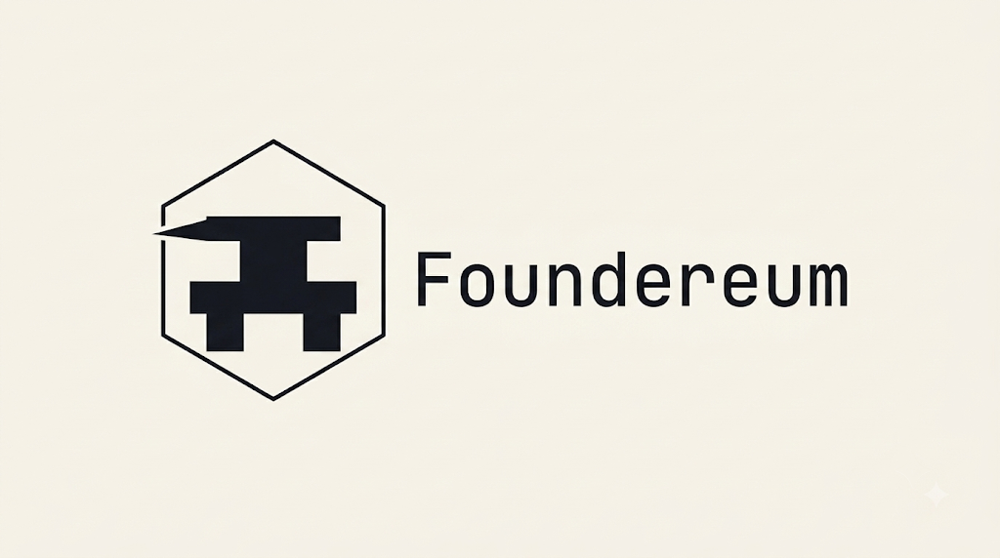

<p align="center">
  
</p>

<p align="center">
  <strong>Autonomous AI agent micro-metering, cryptographic spending policies, and instant x402 settlement on Hedera.</strong>
</p>

<p align="center">
  <a href="https://app.foundereum.org"><strong>Live Dashboard</strong></a> •
  <a href="https://api.foundereum.org/healthz"><strong>API Status</strong></a> •
  <a href="https://gw.foundereum.org/healthz"><strong>Gateway</strong></a> •
  <a href="https://mcp.foundereum.org/healthz"><strong>MCP Server</strong></a> •
  <a href="https://hashscan.io/testnet/topic/0.0.10442234"><strong>HCS Audit Topic</strong></a>
</p>

---

## Overview

**Foundereum** is an institutional-grade, x402-gated agentic execution platform. AI agents (Claude Desktop, Claude Code, AutoGPT, or any Model Context Protocol client) are provisioned with:
1. **A Privy TEE-Secured Server Wallet** — Keys are permanently isolated in hardware enclaves.
2. **Cryptographic Spend Policies** — 24-hour spend limits, contract allowlists, and selector allowlists enforced in hardware before signing.
3. **Double-Entry Financial Ledger** — Invariant-backed PostgreSQL ledger enforcing balance non-negativity and replay prevention.
4. **x402 Micropayment Engine** — Pay-per-call settlement in HTS USDC over Hedera Testnet via the Blocky402 facilitator.
5. **Decentralized Intelligence** — High-speed live blockchain data powered by The Graph (Messari Standardized Subgraphs) with prompt-injection defense delimiters.
6. **Immutable Public Audit** — Every settled call and payment proof is mirrored in real time to Hedera Consensus Service (HCS).

---

## Target Hackathon Tracks & Partner Integrations

| Partner | Category & Focus | Key Integration | Code References |
|---------|------------------|-----------------|-----------------|
| **Hedera** | 🤖 **AI & Agentic Payments on Hedera** ($6,000) | Native HTS USDC micropayments, Blocky402 facilitator settlement, HCS public audit topic, ERC-8004 agent registry on Hedera EVM (Chain ID 296) | [`internal/x402/hedera/transfer.go#L29`](https://github.com/Himesh-Kundal/foundereum/blob/main/internal/x402/hedera/transfer.go#L29)<br>[`internal/hcs/hcs.go#L53`](https://github.com/Himesh-Kundal/foundereum/blob/main/internal/hcs/hcs.go#L53) |
| **The Graph** | 🤖 **Best AI Tooling / Use Case** ($5,000)<br>🧩 **Standardized Graph Products** ($5,000) | Model Context Protocol (MCP) server integration, Messari Standardized DEX Subgraphs for TVL/pool health, `data (untrusted):` prompt injection hygiene | [`sidecars/subgraph-mcp/server.js#L53`](https://github.com/Himesh-Kundal/foundereum/blob/main/sidecars/subgraph-mcp/server.js#L53)<br>[`internal/tools/graph/graph_tools.go#L23`](https://github.com/Himesh-Kundal/foundereum/blob/main/internal/tools/graph/graph_tools.go#L23) |
| **Privy** | 🏢 **Best B2B Financial Product** ($2,500)<br>💸 **Best Financial Flow** ($2,500) | TEE Server Wallets, strict `default_action: DENY` policy engine, and in-browser WebCrypto P-256 multi-party quorum signatures for treasury approvals | [`internal/privy/client.go#L43`](https://github.com/Himesh-Kundal/foundereum/blob/main/internal/privy/client.go#L43)<br>[`web/src/components/ApprovalCard.tsx#L60`](https://github.com/Himesh-Kundal/foundereum/blob/main/web/src/components/ApprovalCard.tsx#L60) |

---

## Architecture & Data Flow

```
[Claude Desktop / AI Agent]
         │ (JSON-RPC MCP Protocol)
         ▼
[foundereum-mcp (Bridge)]
         │ (Streamable HTTP /mcp)
         ▼
[cmd/mcp Server] ──(HTTP)──► [cmd/gateway] ──(x402)──► [Blocky402 / Facilitator]
                                  │                             │
                                  ├──► [The Graph Subgraphs]    └──► [Hedera Testnet]
                                  ├──► [Privy TEE Signer]              (HTS USDC, HCS)
                                  └──► [SaucerSwap Router]
```

### The x402 Machine Settlement Cycle:
1. **Challenge (`402 Payment Required`)**: Agent calls a metered tool (e.g. `swap_tokens` or `analyze_pool_health`). Gateway returns HTTP 402 with required HTS token, destination, exact amount, and cryptographic nonce.
2. **TEE Signature Generation**: The agent runtime requests an HTS transfer transaction signed inside Privy's hardware enclave without exposing private keys.
3. **Atomic Facilitator Settlement**: Gateway submits the signed payload to Blocky402 facilitator, executing the transfer on Hedera testnet.
4. **Ledger & Audit Logging**: The double-entry ledger is credited/debited in PostgreSQL, and a consensus record is immutably logged to Hedera Consensus Service (`0.0.10442234`).
5. **Tool Execution (`200 OK`)**: The requested action executes and returns structured data to the agent.

---

## Core Components

- **`cmd/api` (:8080)**: Control plane REST API for Privy auth sessions, orgs, projects, wallets, Privy policies, API keys, and multi-party quorum approvals.
- **`cmd/gateway` (:8081)**: High-throughput machine gateway implementing x402 HTTP challenge & settlement, Redis token-bucket rate limiting, idempotency, and metered tool execution.
- **`cmd/mcp` (:8082)**: Model Context Protocol server exposing tool schemas over Streamable HTTP and managing the automated x402 client loop.
- **`cmd/worker`**: Asynq background worker handling Hedera account bootstrapping, HCS audit logging, and mirror node balance reconciliation.
- **`contracts/`**: Foundry project hosting `AgentIdentityRegistry.sol` (ERC-8004) deployed on Hedera EVM (Chain ID 296).
- **`web/`**: Foundry Paper aesthetic React 18 + TypeScript + Vite + Tailwind dashboard with live SSE streaming.
- **`bridge/`**: `foundereum-mcp` CLI stdio-to-HTTP proxy for seamless Claude Desktop integration.

---

## Metered Toolbelt & Pricing

| Tool | Pricing Model | Description |
|------|--------------|-------------|
| `get_balances` | Free | Current USDC & HBAR balances for treasury and agent wallets |
| `get_project_info` | Free | Project IDs, Hedera accounts, and HCS topic references |
| `transfer_token` | $0.002 flat | Transfer USDC/HBAR from agent wallet |
| `search_subgraphs` | $0.00001 flat | Search The Graph subgraphs by keyword |
| `execute_subgraph_query` | $0.00001 base + $0.000002/KB | Execute GraphQL query against any indexed subgraph |
| `analyze_pool_health` | $0.0005 base + pass-through | Pool health analysis (0-100 score) using Messari subgraphs |
| `get_swap_quote` | $0.0001 flat | Price impact and expected output quote |
| `swap_tokens` | $0.005 + 5 bps (cap $0.05) | Decentralized token swap via SaucerSwap router |
| `verify_agent` | $0.00001 flat | Verify agent identity on ERC-8004 registry |

---

## Quickstart

### Prerequisites
- **Go 1.23+**
- **Node.js 20+ & pnpm**
- **Foundry (`forge`)**
- **Docker & Docker Compose**

### Running Locally with Docker
```bash
# 1. Clone repository
git clone https://github.com/Himesh-Kundal/foundereum.git
cd foundereum

# 2. Configure environment
cp .env.example .env

# 3. Start development stack
make dev
# Spins up PostgreSQL, Redis, API, Gateway, MCP, Worker, and Subgraph MCP sidecar
```

### Claude Desktop Integration
Add Foundereum to your `claude_desktop_config.json`:
```json
{
  "mcpServers": {
    "foundereum": {
      "command": "npx",
      "args": ["-y", "foundereum-mcp", "--url", "https://mcp.foundereum.org/mcp"],
      "env": {
        "FOUNDEREUM_API_KEY": "fnd_sk_live_your_key_here"
      }
    }
  }
}
```

---

## Verification & Testing

Foundereum features an exhaustive 8-layer verification matrix covering DevOps, DB/ledger invariants, REST API, x402 gateway, tool execution, MCP loop, frontend UI journeys, and threat models:

```bash
# Run unit & integration tests
make test

# Run smart contract tests
make contracts

# Run end-to-end headless browser test suite
cd web && node scripts/test-frontend.cjs
```

---

## License

BUSL-1.1 (Business Source License 1.1) — see [`LICENSE`](LICENSE) and [`LICENSE_RATIONALE.md`](LICENSE_RATIONALE.md).
