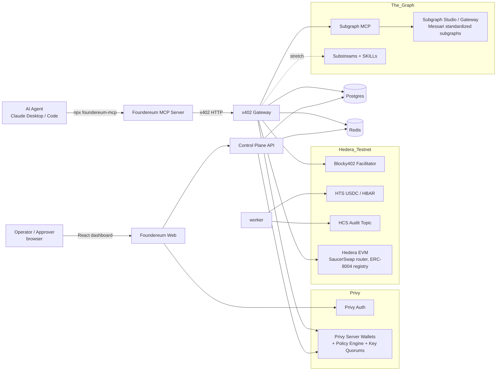
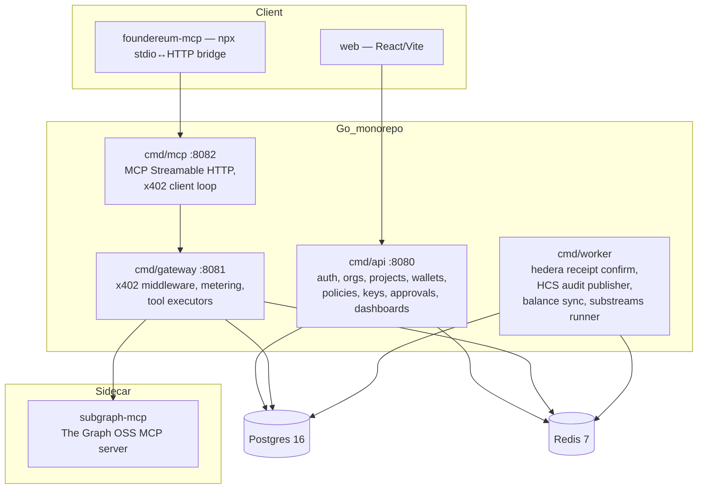
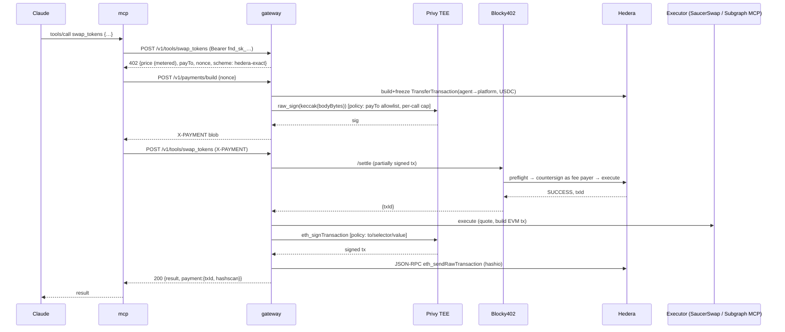

# 02 — System Architecture

## 1. Context



## 2. Containers



| Binary | Scaling | Holds |
|--------|---------|-------|
| `api` | low QPS, human | Privy app secret, JWT secret, faucet operator key |
| `gateway` | high QPS, machine | Privy authorization key (sign-only), Blocky402 URL, Graph API key |
| `mcp` | one session per agent | developer API key for the session only |
| `worker` | cron/batch | HCS topic submit key, Hedera operator for receipts |

Dev: all in one `docker compose up`. Demo: same, behind Caddy.

## 3. Request path



Two signatures per action, both inside Privy's TEE, both policy-checked. Claude never touches either.

## 4. One chain: how Privy wallets control Hedera accounts

Privy issues **Ethereum (secp256k1 ECDSA)** server wallets. Hedera supports ECDSA accounts and **auto-creates an account when HBAR is sent to the EVM address alias**. So:

1. `api` creates a Privy Ethereum wallet → `0xabc…`.
2. `api` faucet sends 5 HBAR to `0xabc…` on Hedera testnet → account `0.0.NNNN` auto-created with that key.
3. Native SDK transactions (HTS transfer for x402): `tx.FreezeWith(client)` → `bodyBytes` → `keccak256` → **Privy `raw_sign`** → `(r‖s)` → `tx.AddSignature(pubKey, sig)`.
4. EVM transactions (swap, deploy): Privy `eth_signTransaction` with `chainId 296` → broadcast via Hashio JSON-RPC relay.

`wallet.Signer` interface hides both; `local.Signer` (encrypted key on disk) is the day-0 fallback if `raw_sign` misbehaves — the swap is one env var.

## 5. Stack

### Go
| Concern | Library |
|---------|---------|
| Router | `go-chi/chi` v5 |
| DB | `jackc/pgx` v5 + `sqlc`; `pressly/goose` migrations |
| Redis / jobs | `redis/go-redis` v9; `hibiken/asynq` |
| Hedera | `hashgraph/hedera-sdk-go` v2 (HTS, HCS, freeze/partial sign, receipts) |
| EVM | `ethereum/go-ethereum` (`ethclient`, `abi`, `abigen`) against Hashio RPC |
| Privy | hand-written REST client (`internal/privy`): wallets, policies, key quorums, `raw_sign`, `eth_signTransaction` |
| MCP (server + client) | `modelcontextprotocol/go-sdk` — server for Claude, client for the subgraph-mcp sidecar |
| Config / logs / metrics | `caarlos0/env`, `log/slog`, `prometheus/client_golang` |
| Money | `shopspring/decimal`; DB `NUMERIC` |

### React
Vite + TS, TanStack Query, Tailwind + shadcn/ui, `@privy-io/react-auth`, React Router, Recharts, SSE via `EventSource`.

### Sidecar
`subgraph-mcp` — The Graph's open-source Subgraph MCP server, run as its own container with `GRAPH_API_KEY`. Gateway is an MCP *client* to it and re-exposes tools under x402 + metering.

### Contracts
One tiny Foundry project: `AgentIdentityRegistry.sol` (ERC-8004-style) deployed to Hedera EVM testnet. That's it.

## 6. Postgres over Mongo

| Need | Postgres | Mongo |
|------|----------|-------|
| Ledger: no double-charge, replay-safe | Unique index on `payments.nonce`, row locks, `CHECK (balance >= 0)` | Doable, more code, weaker guarantees by default |
| Relational core: org → members → projects → wallets → keys → calls → payments → approvals | FKs + joins | Manual denormalization |
| Semi-structured: policy JSON, tool args, 402 payloads | JSONB + GIN | Native |
| Substreams sink (Graph stretch) | `substreams-sink-sql` targets Postgres | Not supported |
| Dashboard analytics | window functions | aggregation pipeline |

**Postgres 16 + Redis 7.** Redis takes the hot path (nonces, rate limits, idempotency, job queue).

## 7. Repo layout

```
foundereum/
├── docs/
├── go.mod
├── cmd/{api,gateway,mcp,worker}/main.go
├── internal/
│   ├── config/
│   ├── db/{migrations,queries,gen}/
│   ├── auth/          # Privy access-token verification (JWKS), sessions, API key hashing, org roles
│   ├── org/           # orgs, members, roles
│   ├── project/
│   ├── wallet/        # Signer interface; privy.Signer; local.Signer; hedera account bootstrap
│   ├── privy/         # REST client: wallets, policies, key quorums, raw_sign, eth_signTransaction
│   ├── policy/        # policy model → Privy policy JSON; local pre-check; rolling velocity
│   ├── approvals/     # quorum actions (withdraw, policy edit)
│   ├── x402/
│   │   ├── middleware.go
│   │   ├── challenge.go
│   │   ├── pricing.go       # metered pricing rules
│   │   └── hedera/          # TransferTransaction build/partial-sign, Blocky402 client
│   ├── tools/
│   │   ├── registry.go
│   │   ├── wallet/          # get_balances, transfer_token
│   │   ├── swap/            # SaucerSwap router (v2-style) quote + swap
│   │   ├── deploy/          # deploy_contract on Hedera EVM
│   │   ├── graph/           # search/schema/execute proxy + analyze_pool_health + compare_protocol_tvl
│   │   ├── identity/        # verify_agent (ERC-8004)
│   │   └── substreams/      # stretch
│   ├── mcpserver/           # MCP tool defs + x402 client loop
│   ├── ledger/
│   ├── hcs/                 # audit publisher
│   ├── worker/              # asynq handlers
│   ├── chain/               # hedera client pool, EVM client, ABI bindings, addresses
│   └── httpx/
├── contracts/               # Foundry: AgentIdentityRegistry.sol, deploy script, deployments/hedera-testnet.json
├── web/
├── bridge/                  # npm: foundereum-mcp
├── sidecars/subgraph-mcp/
├── deploy/                  # docker-compose.yml, Dockerfiles, Caddyfile
├── SKILL.md                 # for Graph judges: how an agent uses foundereum-mcp
└── Makefile
```

## 8. Cross-cutting

- **Idempotency:** `Idempotency-Key` per tool call (MCP server generates); Redis 24h; replay returns cached response, no second charge.
- **Money:** base units in `NUMERIC(38,0)` + `decimals`; USD in `NUMERIC(20,10)`.
- **Errors:** `{ "error": { "code", "message", "details" } }`; MCP maps to `isError:true` with the message so Claude can explain.
- **Time:** `TIMESTAMPTZ`, UTC.
- **Untrusted data marker:** every subgraph result returned to Claude is prefixed `data (untrusted):` — prompt-injection hygiene for the Graph judges to notice.
