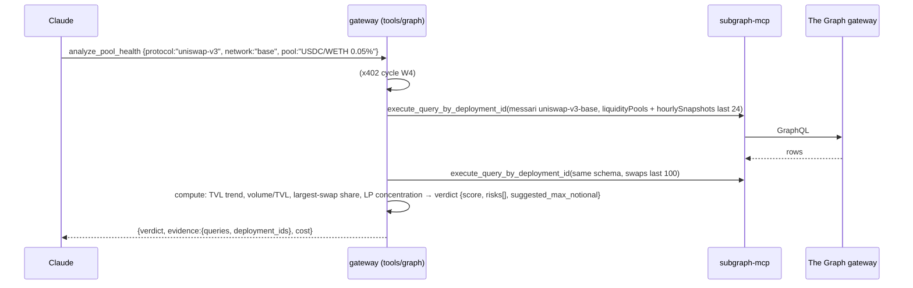
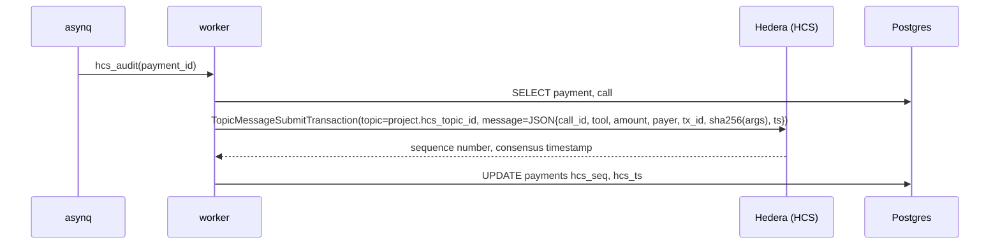

# 03 — Workflows

---

## W1. Sign in with Privy → org → members

```mermaid
sequenceDiagram
    participant U as Operator
    participant W as web (@privy-io/react-auth)
    participant PA as Privy Auth
    participant A as api
    participant PG as Postgres

    U->>W: Login (email OTP / Google)
    W->>PA: Privy modal flow
    PA-->>W: access token (JWT)
    W->>A: POST /v1/auth/session  (Authorization: Bearer <privy token>)
    A->>PA: verify via JWKS (privy app id/aud)
    A->>PG: upsert users(privy_did); create org if first login
    A-->>W: {session jwt, user, org, role}
    U->>W: Org → Invite teammate as Approver
    W->>A: POST /v1/orgs/{id}/members {email, role:"approver"}
    A->>PG: INSERT members(status=invited)
```

Roles: `owner` (everything), `approver` (approve quorum actions, view), `viewer`. Dev bypass: `AUTH_DEV_BYPASS=true` → `POST /v1/auth/dev`.

---

## W2. Create project → Privy wallets → Hedera account bootstrap → policy push

```mermaid
sequenceDiagram
    participant W as web
    participant A as api
    participant PV as Privy
    participant H as Hedera testnet
    participant PG as Postgres
    participant Q as asynq

    W->>A: POST /v1/projects {name:"market-scout", policy_template:"conservative", quorum:{threshold:2}}
    A->>PG: INSERT projects(status=provisioning)
    A->>PV: POST /v1/wallets {chain_type:"ethereum"}   → treasury wallet 0xT…
    A->>PV: POST /v1/wallets {chain_type:"ethereum"}   → agent wallet    0xA…
    A->>PV: POST /v1/policies {template rendered}      → policy_id
    A->>PV: PATCH /v1/wallets/{agent} {policy_ids:[policy_id]}
    A->>PG: INSERT wallets ×2, policies
    A-->>W: 201 {project, wallets(status: bootstrapping)}
    A->>Q: enqueue bootstrap_hedera(project)

    Q->>H: TransferTransaction: faucet → 0xT… (5 HBAR), faucet → 0xA… (5 HBAR)   (auto-creates accounts)
    Q->>H: query AccountInfo by EVM alias → 0.0.T, 0.0.A
    Q->>H: TokenAssociateTransaction(USDC) signed by each wallet via Privy raw_sign
    Q->>H: faucet → 0.0.T: 50 test USDC ; 0.0.T → 0.0.A: 10 USDC (initial agent budget)
    Q->>H: TopicCreateTransaction (memo: "foundereum:audit:<project>") → topic 0.0.X
    Q->>PG: UPDATE wallets hedera_account_id, status=ready ; projects.hcs_topic_id
    Q-->>W: SSE project.ready
```

- Treasury wallet = org money; agent wallet = the budget an agent may burn. Top-ups are a treasury → agent HTS transfer (a "B2B treasury operation").
- Token association is a signed transaction from the account itself → first exercise of Privy `raw_sign` on Hedera. If it fails, `WALLET_SIGNER=local` flips to the fallback.

---

## W3. Fund treasury → issue API key

```mermaid
sequenceDiagram
    participant W as web
    participant A as api
    participant WK as worker (balance sync)
    participant H as Hedera
    participant PG as Postgres

    W->>A: POST /v1/projects/{id}/faucet   (rate-limited per org)
    A->>H: faucet → treasury: 50 USDC
    loop every 10s
        WK->>H: mirror node /accounts/{id}/tokens
        WK->>PG: UPDATE wallets.balance ; ledger_entries(deposit)
        WK-->>W: SSE wallet.balance
    end
    W->>A: POST /v1/projects/{id}/keys {name:"claude-desktop", wallet:"agent"}
    A->>PG: agent wallet balance ≥ MIN_FUNDING_USD ?
    alt yes
        A->>PG: INSERT api_keys(hash, prefix)
        A-->>W: 201 {key:"fnd_sk_live_…" (once)}
    else no
        A-->>W: 402 TREASURY_UNDERFUNDED
    end
```

---

## W4. x402 request lifecycle (Hedera + Blocky402) — the core loop

```mermaid
sequenceDiagram
    participant C as Claude
    participant M as mcp
    participant G as gateway
    participant RD as Redis
    participant PV as Privy TEE
    participant F as Blocky402
    participant H as Hedera
    participant PG as Postgres
    participant Q as asynq

    C->>M: tools/call execute_subgraph_query {deployment_id, query}
    M->>G: POST /v1/tools/execute_subgraph_query  Bearer fnd_sk_…  Idempotency-Key: uuid
    G->>PG: key → project, agent wallet, policy
    G->>RD: rate limit (token bucket)
    G->>G: price = base + estimate(bytes) → USDC units
    G->>RD: SETEX x402:challenge:{nonce} 120s
    G-->>M: 402 {x402Version:1, accepts:[{scheme:"hedera-exact", network:"hedera-testnet", asset:"0.0.USDC", amount:"30", payTo:"0.0.PLATFORM", extra:{memo:"fnd:"+nonce}}], nonce, expires}
    M->>G: POST /v1/payments/build {nonce}
    G->>H: TransferTransaction(-30 USDC agent, +30 USDC platform).SetTransactionMemo(memo).SetTransactionID(agent).FreezeWith(client)
    G->>G: policy pre-check (payTo ∈ allowlist, amount ≤ per-call cap, 24h velocity)
    G->>PV: raw_sign(keccak256(bodyBytes)) on agent wallet
    PV-->>G: r‖s
    G->>G: tx.AddSignature(agentPubKey, sig) → bytes
    G-->>M: {x_payment: base64({scheme, network, nonce, payload:{transaction: base64(bytes)}})}
    M->>G: POST /v1/tools/execute_subgraph_query  X-PAYMENT: …
    G->>RD: GETDEL x402:challenge:{nonce} (reject if missing → replay/expired)
    G->>F: POST /settle {paymentPayload, paymentRequirements}
    F->>H: preflight (association, balance) → countersign as fee payer → execute
    H-->>F: SUCCESS txId
    F-->>G: {success, txId}
    G->>PG: INSERT calls(status=paid), payments(status=settled, tx_id) ; ledger debit
    G->>G: execute tool → Subgraph MCP → result (N bytes)
    G->>PG: UPDATE calls result, actual_bytes, carry = max(0, actual−estimate)
    G->>Q: enqueue hcs_audit(payment_id)
    G-->>M: 200 {result, payment:{tx_id, hashscan_url, amount_usd}}
    M-->>C: "data (untrusted): …"
```

Failure handling:

| Failure | Response |
|---------|----------|
| Facilitator preflight: no association / insufficient | `402 PAYMENT_FAILED {reason}`; MCP tells Claude "agent wallet needs a top-up (dashboard → Wallets)" |
| Nonce missing/expired | `409 PAYMENT_REPLAYED` |
| Privy policy rejects payment | `403 POLICY_REJECTED {rule}` |
| Tool fails after settlement | `calls.status=failed`; `payments.status=settled`; `ledger_entries(kind=refund_pending)`; worker credits back (Tier 2) — shown honestly in call log |
| Blocky402 down | `FACILITATOR_MODE=self`: gateway holds fee-payer key, countersigns + executes itself (same wire format) |

---

## W5. `swap_tokens` on Hedera (SaucerSwap testnet router)

```mermaid
sequenceDiagram
    participant C as Claude
    participant G as gateway
    participant EVM as Hedera EVM (Hashio RPC)
    participant PV as Privy

    C->>G: swap_tokens {token_in:"USDC", token_out:"HBAR", amount_in:"5", slippage_bps:50}
    G->>G: (x402 cycle W4; price = $0.005 + 0.05% × $5)
    G->>EVM: router.getAmountsOut(5e6, [USDC, WHBAR])
    EVM-->>G: amounts
    G->>G: minOut = out × (1 − slippage)
    G->>EVM: allowance(agent, router) — if 0, build approve(router, amount)
    G->>PV: eth_signTransaction(approve) [policy: to=USDC, selector=approve]
    G->>EVM: eth_sendRawTransaction ; wait receipt
    G->>G: build router.swapExactTokensForETH(amountIn, minOut, path, agent, deadline)
    G->>PV: eth_signTransaction [policy: to=router, selector, value=0]
    alt allowed
        PV-->>G: raw tx
        G->>EVM: eth_sendRawTransaction ; wait receipt (≤ 15s)
        G-->>C: {tx_hash, hashscan_url, amount_out}
    else rejected
        G-->>C: 403 POLICY_REJECTED {rule:"contract_allowlist"}
    end
```

Note: HTS tokens on Hedera EVM are ERC-20-compatible via the HTS precompile, so `approve`/`transferFrom` work; the router address must be in the policy allowlist. `swap_tokens` is infra for the demo (a paid action worth paying for), not a prize submission.

---

## W6. Graph-driven decision: `analyze_pool_health` (what makes The Graph load-bearing)



- Uses **Messari standardized subgraphs** → same query works for `uniswap-v3`, `sushiswap`, `aerodrome` on any indexed network. `compare_protocol_tvl {protocols:[…], network}` fans out the same query across N deployments — "one query pattern spanning many protocols."
- Claude then chains into `swap_tokens` (or declines). That's "reasoning, decisions, automation," not "printing a raw query result."

---

## W7. HCS audit trail (worker)



Dashboard `/audit` reads the mirror node topic messages and cross-checks against `payments` → "verifiable payment audit trails on HCS." The platform pays HCS fees (~$0.0001/msg).

---

## W8. Quorum-gated treasury withdrawal (Privy key quorum)

```mermaid
sequenceDiagram
    participant O as Owner
    participant Ap as Approver
    participant W as web
    participant A as api
    participant PV as Privy
    participant H as Hedera

    O->>W: Wallets → Withdraw 500 USDC to 0.0.EXT
    W->>A: POST /v1/projects/{id}/approvals {type:"withdraw", payload}
    A->>A: amount > threshold → requires quorum (2 of [owner, approver])
    A->>PV: build unsigned HTS transfer (treasury → 0.0.EXT); request signature with owner's authorization key
    A-->>W: {approval id, status: 1/2}
    Ap->>W: Approvals inbox → Approve
    W->>A: POST /v1/approvals/{id}/approve  (approver's Privy authorization key signs the request)
    A->>PV: submit with quorum signatures (treasury wallet owner = key quorum {owner_key, approver_key}, threshold 2)
    PV-->>A: signed tx
    A->>H: execute
    A-->>W: {status: executed, tx_id}
```

Implementation: treasury wallet's **owner is a Privy key quorum** with threshold 2; each member holds a P-256 authorization key generated at invite time (private half in the member's browser via WebCrypto, non-exportable; public half registered with Privy). Policy edits use the same mechanism (the "action" is `PATCH policy`). App-level fallback (`QUORUM_MODE=app`): signatures are on our challenge, and the `api` executes with a single platform key — clearly labelled in demo.

---

## W9. Substreams single-prompt deploy (stretch — Graph featured challenge)

```
Claude → deploy_substreams_pipeline { prompt: "index all Transfer events of USDC on Base into Postgres, hourly volume per sender", network: "base" }
  gateway → x402 ($0.25) → enqueue substreams_deploy
  worker  → launches a sandbox container with substreams CLI + substreams-skills (substreams-dev, substreams-sql)
          → runs a scripted Claude Code session with the prompt → scaffolds Rust module, substreams.yaml (map/store/index), sink config
          → substreams build → substreams-sink-sql setup + run against The Graph Market endpoint → Postgres schema sub_<project>
          → streams logs to SSE
  gateway ← {pipeline_id, tables, sample_rows}
```

Then `execute_pipeline_query {pipeline_id, sql}` lets the agent read its own pipeline — closing the loop for judges.
