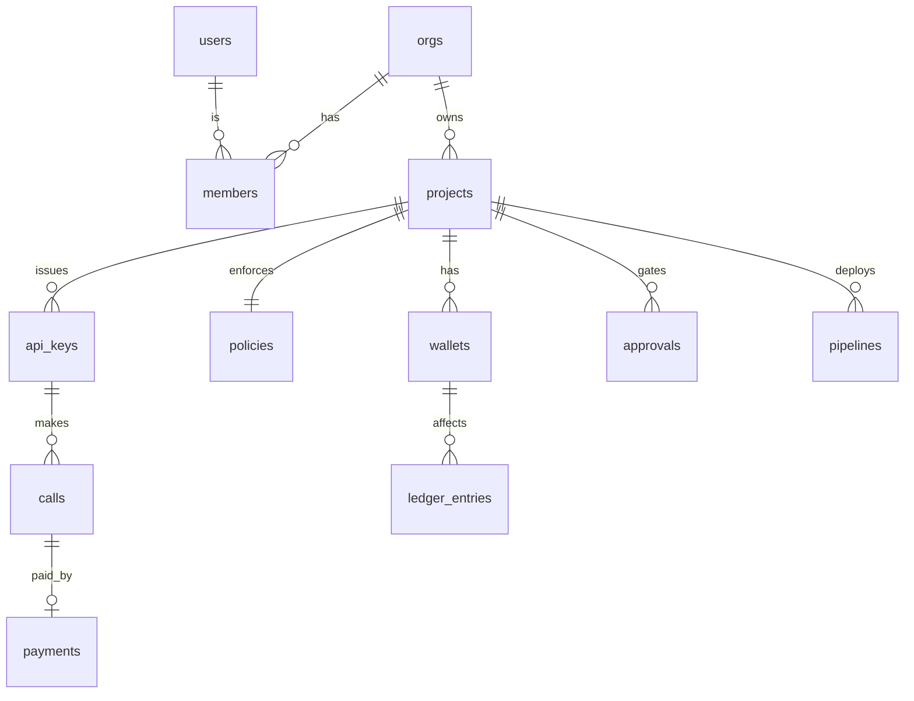

# 05 — Data Model

## 1. ER



## 2. DDL (goose `0001_init.sql`, condensed)

```sql
CREATE EXTENSION IF NOT EXISTS pgcrypto;

CREATE TABLE users (
  id          UUID PRIMARY KEY DEFAULT gen_random_uuid(),
  privy_did   TEXT UNIQUE NOT NULL,              -- did:privy:…
  email       TEXT,
  created_at  TIMESTAMPTZ NOT NULL DEFAULT now()
);

CREATE TABLE orgs (
  id          UUID PRIMARY KEY DEFAULT gen_random_uuid(),
  name        TEXT NOT NULL,
  created_at  TIMESTAMPTZ NOT NULL DEFAULT now()
);

CREATE TABLE members (
  org_id      UUID NOT NULL REFERENCES orgs(id),
  user_id     UUID REFERENCES users(id),          -- NULL until invite accepted
  email       TEXT NOT NULL,
  role        TEXT NOT NULL CHECK (role IN ('owner','approver','viewer')),
  status      TEXT NOT NULL DEFAULT 'invited' CHECK (status IN ('invited','active')),
  auth_pubkey TEXT,                               -- P-256 public key for quorum approvals
  privy_authorization_key_id TEXT,                -- registered with Privy (QUORUM_MODE=privy)
  PRIMARY KEY (org_id, email)
);

CREATE TABLE projects (
  id              UUID PRIMARY KEY DEFAULT gen_random_uuid(),
  org_id          UUID NOT NULL REFERENCES orgs(id),
  slug            TEXT NOT NULL,
  name            TEXT NOT NULL,
  status          TEXT NOT NULL DEFAULT 'provisioning' CHECK (status IN ('provisioning','active','suspended')),
  hcs_topic_id    TEXT,                           -- 0.0.x
  quorum_threshold SMALLINT NOT NULL DEFAULT 1,
  withdraw_quorum_min_usd NUMERIC(20,10) NOT NULL DEFAULT 100,
  erc8004_agent_id NUMERIC(78,0),
  created_at      TIMESTAMPTZ NOT NULL DEFAULT now(),
  UNIQUE (org_id, slug)
);

CREATE TABLE wallets (
  id                 UUID PRIMARY KEY DEFAULT gen_random_uuid(),
  project_id         UUID NOT NULL REFERENCES projects(id),
  kind               TEXT NOT NULL CHECK (kind IN ('treasury','agent')),
  custody            TEXT NOT NULL CHECK (custody IN ('privy','local')),
  privy_wallet_id    TEXT,
  local_key_ref      TEXT,
  evm_address        TEXT NOT NULL,               -- 0x…, also the Hedera EVM alias
  hedera_account_id  TEXT,                        -- 0.0.x after bootstrap
  public_key_hex     TEXT,                        -- compressed secp256k1 for AddSignature
  status             TEXT NOT NULL DEFAULT 'bootstrapping' CHECK (status IN ('bootstrapping','ready','error')),
  usdc_balance       NUMERIC(38,0) NOT NULL DEFAULT 0,   -- 6 dp base units (cache)
  hbar_balance       NUMERIC(38,0) NOT NULL DEFAULT 0,   -- tinybar (cache)
  balance_synced_at  TIMESTAMPTZ,
  created_at         TIMESTAMPTZ NOT NULL DEFAULT now(),
  UNIQUE (evm_address)
);
CREATE INDEX ON wallets (project_id);

CREATE TABLE policies (
  id              UUID PRIMARY KEY DEFAULT gen_random_uuid(),
  project_id      UUID NOT NULL UNIQUE REFERENCES projects(id),
  spec            JSONB NOT NULL,
  privy_policy_id TEXT,
  version         INTEGER NOT NULL DEFAULT 1,
  pushed_at       TIMESTAMPTZ,
  updated_at      TIMESTAMPTZ NOT NULL DEFAULT now()
);

CREATE TABLE api_keys (
  id           UUID PRIMARY KEY DEFAULT gen_random_uuid(),
  project_id   UUID NOT NULL REFERENCES projects(id),
  wallet_id    UUID NOT NULL REFERENCES wallets(id),   -- the agent wallet that pays
  name         TEXT NOT NULL,
  prefix       TEXT NOT NULL,                          -- fnd_sk_live_ab12
  key_hash     BYTEA NOT NULL UNIQUE,                  -- sha256
  status       TEXT NOT NULL DEFAULT 'active' CHECK (status IN ('active','revoked')),
  carry_usd    NUMERIC(20,10) NOT NULL DEFAULT 0,      -- metering overage to add to next challenge
  last_used_at TIMESTAMPTZ,
  created_at   TIMESTAMPTZ NOT NULL DEFAULT now()
);

CREATE TABLE calls (
  id               UUID PRIMARY KEY DEFAULT gen_random_uuid(),
  project_id       UUID NOT NULL REFERENCES projects(id),
  api_key_id       UUID NOT NULL REFERENCES api_keys(id),
  idempotency_key  TEXT NOT NULL,
  tool             TEXT NOT NULL,
  args             JSONB NOT NULL,
  status           TEXT NOT NULL CHECK (status IN ('challenged','paid','executing','succeeded','failed','rejected')),
  error            JSONB,
  result           JSONB,
  estimate_usd     NUMERIC(20,10) NOT NULL,
  actual_usd       NUMERIC(20,10),
  metered_bytes    INTEGER,
  tx_hash          TEXT,                                -- EVM tx (swap/deploy) if any
  latency_ms       INTEGER,
  started_at       TIMESTAMPTZ NOT NULL DEFAULT now(),
  finished_at      TIMESTAMPTZ,
  UNIQUE (api_key_id, idempotency_key)
);
CREATE INDEX ON calls (project_id, started_at DESC);

CREATE TABLE payments (
  id           UUID PRIMARY KEY DEFAULT gen_random_uuid(),
  call_id      UUID NOT NULL UNIQUE REFERENCES calls(id),
  project_id   UUID NOT NULL REFERENCES projects(id),
  wallet_id    UUID NOT NULL REFERENCES wallets(id),
  nonce        TEXT NOT NULL UNIQUE,                    -- x402 challenge nonce (also HTS memo)
  asset        TEXT NOT NULL,                           -- HTS token id
  amount       NUMERIC(38,0) NOT NULL,                  -- base units
  amount_usd   NUMERIC(20,10) NOT NULL,
  facilitator  TEXT NOT NULL CHECK (facilitator IN ('blocky402','self')),
  status       TEXT NOT NULL CHECK (status IN ('submitted','settled','failed','refunded')),
  hedera_tx_id TEXT,                                    -- 0.0.x@sec.nanos
  hcs_seq      BIGINT,
  hcs_ts       TEXT,
  created_at   TIMESTAMPTZ NOT NULL DEFAULT now(),
  settled_at   TIMESTAMPTZ
);
CREATE INDEX ON payments (status) WHERE status = 'submitted';

CREATE TABLE ledger_entries (
  id          BIGSERIAL PRIMARY KEY,
  wallet_id   UUID NOT NULL REFERENCES wallets(id),
  asset       TEXT NOT NULL,                            -- 'USDC' | 'HBAR'
  amount      NUMERIC(38,0) NOT NULL,                   -- signed base units
  amount_usd  NUMERIC(20,10),
  kind        TEXT NOT NULL CHECK (kind IN ('deposit','payment','refund_pending','refund','topup','withdraw','swap_in','swap_out','gas','adjustment')),
  ref_type    TEXT, ref_id TEXT,
  created_at  TIMESTAMPTZ NOT NULL DEFAULT now()
);
CREATE INDEX ON ledger_entries (wallet_id, created_at DESC);

CREATE TABLE approvals (
  id            UUID PRIMARY KEY DEFAULT gen_random_uuid(),
  project_id    UUID NOT NULL REFERENCES projects(id),
  type          TEXT NOT NULL CHECK (type IN ('withdraw','policy_update','key_rotate','agent_topup')),
  payload       JSONB NOT NULL,
  challenge     BYTEA NOT NULL,
  threshold     SMALLINT NOT NULL,
  signatures    JSONB NOT NULL DEFAULT '[]',            -- [{member_email, sig, at}]
  status        TEXT NOT NULL DEFAULT 'pending' CHECK (status IN ('pending','executed','rejected','expired')),
  result_tx_id  TEXT,
  created_by    TEXT NOT NULL,
  created_at    TIMESTAMPTZ NOT NULL DEFAULT now(),
  expires_at    TIMESTAMPTZ NOT NULL
);

CREATE TABLE pipelines (                               -- substreams (stretch)
  id          UUID PRIMARY KEY DEFAULT gen_random_uuid(),
  project_id  UUID NOT NULL REFERENCES projects(id),
  prompt      TEXT NOT NULL,
  manifest    TEXT,
  schema_name TEXT,
  status      TEXT NOT NULL,
  logs        TEXT,
  created_at  TIMESTAMPTZ NOT NULL DEFAULT now()
);

CREATE TABLE tool_prices (
  tool             TEXT PRIMARY KEY,
  base_usd         NUMERIC(20,10) NOT NULL DEFAULT 0,
  per_kb_usd       NUMERIC(20,10) NOT NULL DEFAULT 0,
  notional_bps     INTEGER NOT NULL DEFAULT 0,
  notional_cap_usd NUMERIC(20,10),
  updated_at       TIMESTAMPTZ NOT NULL DEFAULT now()
);
```

## 3. Key sqlc queries

```sql
-- name: GetKeyContext :one
SELECT k.id AS key_id, k.project_id, k.carry_usd,
       w.id AS wallet_id, w.custody, w.privy_wallet_id, w.hedera_account_id, w.evm_address, w.public_key_hex,
       p.status AS project_status, pol.spec AS policy
FROM api_keys k
JOIN wallets w   ON w.id = k.wallet_id
JOIN projects p  ON p.id = k.project_id
JOIN policies pol ON pol.project_id = p.id
WHERE k.key_hash = $1 AND k.status = 'active' AND w.status = 'ready';

-- name: SpendLast24h :one
SELECT COALESCE(SUM(-amount_usd),0) FROM ledger_entries le JOIN wallets w ON w.id = le.wallet_id
WHERE w.project_id = $1 AND le.kind IN ('payment','swap_out','withdraw') AND le.created_at > now() - interval '24 hours';

-- name: SpendByDay :many
SELECT date_trunc('day', started_at) d, tool, SUM(COALESCE(actual_usd, estimate_usd)) usd, COUNT(*) n
FROM calls WHERE project_id = $1 AND status = 'succeeded' AND started_at > now() - interval '30 days'
GROUP BY 1,2 ORDER BY 1;

-- name: PaymentsMissingAudit :many
SELECT * FROM payments WHERE status='settled' AND hcs_seq IS NULL ORDER BY settled_at LIMIT 100;
```

## 4. Redis keys

| Key | TTL | Purpose |
|-----|-----|---------|
| `x402:challenge:{nonce}` (JSON) | 120s | Outstanding challenge; `GETDEL` on use |
| `idem:{keyId}:{idemKey}` | 24h | Idempotent replay |
| `rl:{keyId}` | — | Token bucket (Lua) |
| `bal:{walletId}` | 10s | Balance read cache |
| `events` pub/sub | — | SSE fan-out |
| `asynq:*` | — | Jobs |

## 5. HCS audit message schema

```json
{ "v": 1, "project": "uuid", "call": "uuid", "tool": "execute_subgraph_query",
  "payer": "0.0.1234", "asset": "0.0.USDC", "amount": "30", "usd": "0.00003",
  "hedera_tx": "0.0.1234@1757300000.123456789", "args_sha256": "…", "ts": "2026-09-08T10:00:00Z" }
```

## 6. Invariants
1. `SUM(ledger_entries.amount) per wallet/asset` == `wallets.*_balance` after reconciliation.
2. `payments.nonce` unique → no double charge even if Redis is flushed.
3. `calls.status='succeeded'` ⇒ `payments.status='settled'`.
4. Every `payments.status='settled'` gets an HCS message (worker catches up via `PaymentsMissingAudit`).
5. `approvals.status='executed'` ⇒ `jsonb_array_length(signatures) >= threshold`.
